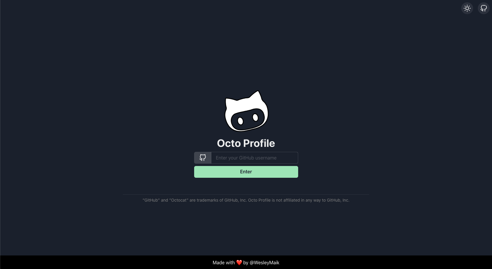
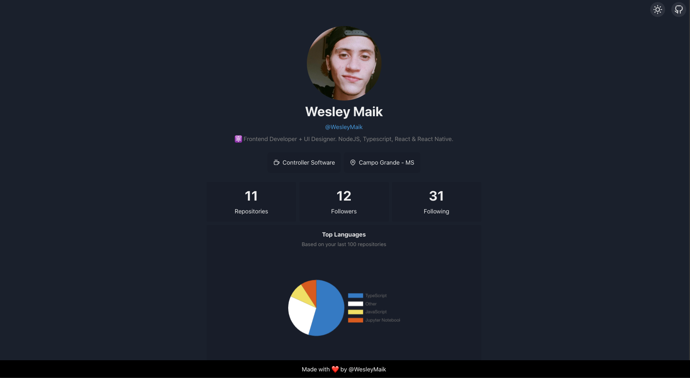

<h1 align="center">Octo Profile</h1>
<p align="center">A nice profile from your GitHub.</p>
<h1 align="center">
    
</h1>

## Demo: https://wesleymaik.github.io/octo-profile




### Requirements

- node >= v16.14.1
- npm or yarn (optional)

### Built with

- ViteJS (React)
- ChakraUI
- React Query
- Chart.JS

### Getting Started

1. Clone the project

```
git clone https://github.com/WesleyMaik/octo-profile
```

2. Install dependencies

```
npm install
```

or

```
yarn install
```

3. Run 🔥

```
npm run dev
```

or

```
yarn dev
```

---

### Feedback

Feedback is appreciated! Reach out on [Twitter](https://twitter.com/euwesleymaik) or submit a new issue!

---

### License

[MIT](https://github.com/WesleyMaik/octo-profile/blob/master/LICENSE)

Inspired by [bchiang7 - octoprofile](https://github.com/bchiang7/octoprofile)
